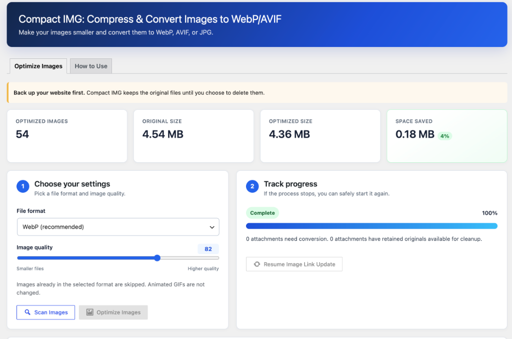

# Compact IMG - Free Image Compression and Conversion WordPress Plugin

Optimize WordPress Media Library images by converting them to WebP, AVIF, or JPG with 100% on-server processing, zero external dependencies, and real-time storage savings analytics.

[](https://opensource.org/licenses/Apache-2.0)
[](https://wordpress.org)
[](https://php.net)
[]()
[]()

[Official Website: CompactIMG.com](https://compactimg.com/) | [Download Latest Plugin ZIP (.zip)](./compact-img-compress-convert-images-to-webpavif.zip) | [Documentation](#key-features-and-functions)

---

## Overview

Compact IMG is an open-source, high-performance image optimization plugin for WordPress developed by [CompactIMG.com](https://compactimg.com/).

Unlike traditional image optimization plugins that require monthly subscriptions, external third-party API keys, or credit quotas, Compact IMG performs 100% of its compression and format conversion directly on your WordPress hosting server.

Using your host's native GD or ImageMagick (Imagick) engine, Compact IMG transforms bulky PNG and JPEG uploads into modern WebP and AVIF formats, reducing storage requirements and bandwidth usage by 30% to 90% while improving page load speeds, Google PageSpeed scores, and Core Web Vitals.



---

## Key Features and Functions

### 1. Next-Gen Image Format Conversion (WebP and AVIF)
* **WebP Conversion:** Produces universally supported WebP files (supported by over 97% of modern browsers) that are 25% to 45% smaller than comparable JPEGs and PNGs.
* **AVIF Conversion:** Produces cutting-edge AVIF files with next-generation compression algorithms delivering up to 50% better compression than WebP with high visual fidelity.
* **JPG Re-Compression:** Re-encodes and compresses standard JPEG images when a standard format is preferred.
* **Granular Quality Control:** Features an interactive slider (40-100) allowing you to choose the balance between file size reduction and image clarity (recommended: 82).

### 2. Comprehensive Media and Thumbnail Coverage
* Converts the original master image uploaded to WordPress.
* Processes all registered intermediate thumbnail sizes (thumbnail, medium, medium_large, large, and custom crop sizes registered by your theme or plugins).
* Handles WordPress pre-scaled "-scaled" images seamlessly, updating the wp_get_attachment_metadata structures accordingly.

### 3. 100% On-Server and Zero-Cost Architecture
* **No API Keys Needed:** Operates completely offline without external cloud accounts.
* **Unlimited Optimizations:** Optimize 10 images or 100,000 images without paying fees or hitting usage limits.
* **Complete Privacy:** Image binary data never leaves your infrastructure, ensuring full data privacy.

### 4. Non-Destructive Workflow and Safety Guards
* **Zero Overwriting:** Source images are never overwritten during conversion; newly formatted images are created alongside existing files.
* **Atomic Attachment Switch:** An attachment record only transitions to the new format once every registered thumbnail size has converted successfully.
* **Automatic GIF Preservation:** Animated GIFs are automatically detected and skipped to preserve playback animation.
* **Transient Lock Engine:** Prevents race conditions or double-processing if multiple administrators access the dashboard simultaneously.

### 5. Resumable Database URL Migration
* Compact IMG includes a multi-stage background database scanner that replaces legacy image URLs (.png, .jpg) with new .webp or .avif endpoints across:
  * wp_posts.post_content (Pages, Blog Posts, Custom Post Types)
  * wp_posts.post_excerpt
  * wp_postmeta.meta_value (safely handling serialized PHP arrays and objects without string corruption)
  * wp_comments.comment_content
  * wp_options.option_value (with full serialization safeguards)
* Uses cursor pagination (1,000 rows per batch) and records progress in WordPress options so migration can pause and resume at any point.

### 6. Real-Time Storage Savings Dashboard
* Tracks live metrics directly in the WordPress dashboard:
  * Optimized Image Count
  * Original Disk Size (MB)
  * Optimized Disk Size (MB)
  * Net Space Saved (MB and %)

### 7. Optional and Confirmed Original File Cleanup
* Retained original files remain stored on disk as a safety fallback.
* Once you have verified your website frontend, the "Delete Retained Originals" feature allows you to permanently remove the source files with one click to free up server disk space.

---

## Ready-to-Download Plugin

You can download the installable plugin ZIP file directly from this repository:

[Download compact-img-compress-convert-images-to-webpavif.zip](./compact-img-compress-convert-images-to-webpavif.zip)

Or download from the [GitHub Releases Page](../../releases).

---

## Installation and Quick Start

### Method 1: WordPress Dashboard Upload (Recommended)
1. Download the [`compact-img-compress-convert-images-to-webpavif.zip`](./compact-img-compress-convert-images-to-webpavif.zip) package.
2. In your WordPress admin, go to Plugins > Add New > Upload Plugin.
3. Choose the downloaded ZIP file and click Install Now.
4. Click Activate Plugin.

### Method 2: Manual FTP / SFTP Installation
1. Extract `compact-img-compress-convert-images-to-webpavif.zip`.
2. Upload the `compact-img-compress-convert-images-to-webpavif` folder into your `/wp-content/plugins/` directory.
3. Navigate to Plugins > Installed Plugins and activate Compact IMG: Compress & Convert Images to WebP/AVIF.

---

## How to Optimize Your Media Library

1. Go to Tools > Compact IMG in your WordPress admin menu.
2. **Step 1: Configure**
   - Choose your target format: WebP (Recommended), AVIF, or JPG.
   - Set the quality level (Default 82 provides the optimal balance of compression and visual fidelity).
3. **Step 2: Scan**
   - Click Scan Images to discover eligible attachments and estimate potential savings.
4. **Step 3: Optimize**
   - Click Optimize Images. Keep your browser tab open while the background batch worker processes your library.
   - You can click "Stop safely" at any time; progress is automatically saved.
5. **Step 4: Link Migration**
   - Allow the automated Image Link Update to finish updating your database references across posts, pages, and meta.
6. **Step 5: Verify and Clean Up (Optional)**
   - Inspect your frontend pages, featured images, and galleries.
   - If everything looks great, click Delete Retained Originals to reclaim disk space.

---

## Repository and Plugin Structure

```text
.
|-- compact-img-compress-convert-images-to-webpavif/          # Plugin Source Code
|   |-- assets/
|   |   |-- admin.css                                         # Admin styling
|   |   `-- admin.js                                          # Batch AJAX engine and UI controller
|   |-- includes/
|   |   |-- class-wmfc-converter.php                          # Image conversion and DB migration engine
|   |   `-- class-wmfc-plugin.php                             # Admin routing, AJAX endpoints and menus
|   |-- compact-img-compress-convert-images-to-webpavif.php   # Main entry point and headers
|   |-- license.txt                                           # Apache-2.0 License notice
|   |-- readme.txt                                            # WordPress.org standard documentation
|   `-- uninstall.php                                         # Cleanup upon deletion
|-- compact-img-compress-convert-images-to-webpavif-wordpress-org/ # Assets and artwork
|   |-- assets/                                               # Banners and icons
|   `-- source-artwork/                                       # High-res source graphics
|-- compact-img-compress-convert-images-to-webpavif.zip       # Ready-to-download installable ZIP
|-- LICENSE                                                   # Apache License 2.0
|-- README.md                                                 # GitHub documentation
`-- task.md                                                   # Task tracking log
```

---

## System Requirements

| Requirement | Minimum | Recommended |
| :--- | :--- | :--- |
| **WordPress** | 6.5+ | 6.7+ / 7.0+ |
| **PHP** | 7.4+ | 8.1, 8.2, 8.3 |
| **PHP Extensions** | GD or Imagick | ImageMagick with WebP/AVIF delegate |
| **Memory Limit** | 128 MB | 256 MB+ |
| **Browser Support** | Modern HTML5 Browsers | Chrome, Firefox, Safari, Edge |

---

## Frequently Asked Questions

### 1. Does Compact IMG make any external API calls?
No. Compact IMG runs completely on your WordPress server. It does not contact any external servers, require API keys, or send telemetry data.

### 2. Can I safely pause and resume the optimization process?
Yes. You can pause the optimization process at any time by clicking "Stop safely". Already-converted images are automatically recognized and skipped on subsequent runs.

### 3. Will this break image links in my old blog posts?
No. Compact IMG features an integrated database URL migration tool that automatically searches and replaces old image URLs with the newly generated WebP/AVIF file URLs across all posts, pages, excerpts, comments, and meta tables without corrupting serialized PHP arrays.

### 4. How does Compact IMG handle animated GIFs?
Animated GIFs are automatically detected and skipped to prevent losing animation frames during static image conversion.

### 5. What is the difference between WebP and AVIF?
WebP is supported by almost all modern browsers (>97%) and delivers a 25% to 45% file size reduction. AVIF is an ultra-modern format providing up to 50% better compression than WebP, but requires server-side AVIF compilation support in GD or Imagick.

---

## License

This project is free and open-source software licensed under the **Apache License, Version 2.0**.

See the [LICENSE](./LICENSE) file for details.

---

Developed by [CompactIMG.com](https://compactimg.com/). Optimize your images, speed up your site, and enhance your user experience for free.
